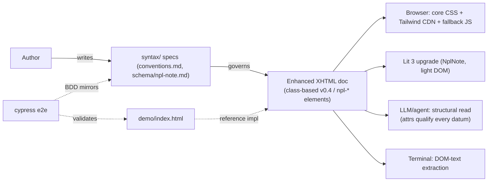

# Project Architecture — npl-enhanced-content

## Overview

npl-enhanced-content defines an XHTML-first rich-content format for NPL
(Noizu Prompt Lingua): documents that are simultaneously human-readable styled
HTML, structurally parseable data for LLMs/agents, and terminal-extractable
text. One file, three consumers. The repo is **spec-first** — tier-0 specs in
`syntax/` precede implementation code, with the Lit `NplNote` component +
standalone demo and cypress e2e currently shipping.

→ *Repo tree: [PROJ-LAYOUT.md](PROJ-LAYOUT.md) · data contract: [PROJ-SCHEMA.md](PROJ-SCHEMA.md)*

## System Diagram

## Core Components

| Component | Purpose |
|-----------|---------|
| Tier-0 specs (`syntax/`) | Authoring conventions (v0.4 class-based baseline) + `npl-note` element schema; BDD source of truth |
| Class-based vocabulary (v0.4) | Identity = `npl-*` classes on plain elements, parameters = `data-*` attrs; mechanical map to future custom elements |
| `npl-fallback` handler | ~2–4KB inline vanilla JS: view-as switching, reveal toggles, highlight occlusion, quiz checking, theme picker — zero external resources for baseline interactivity |
| Lit components (`NplNote` first) | Upgrade elements in place; supersede fallback; light-DOM content, shadow DOM chrome only; handoff via `data-npl-fallback` attr |
| Theme layer | `data-npl-theme` on `<html>`, `--npl-*` tokens, TRP-YAML-compiled CSS, 4 TRP ports, zero-JS theme flips |
| Standalone demo (`demo/index.html`) | Reference implementation of the v0.4 baseline (single file: core CSS + Tailwind `@apply` layer + fallback JS) |
| Cypress e2e (`cypress/`) | Validates demo behavior; mirrors the `npl-note` schema BDD |

→ *Components ↔ directories: see [PROJ-LAYOUT.md](PROJ-LAYOUT.md)*

## Degradation & Rendering Tiers

1. **JS-off**: `npl-*:not(:defined)` theme CSS — accent borders, variant labels, presentable, no layout shift on upgrade.
2. **Fallback**: embedded vanilla handler provides full baseline interactivity (Lit-free single-file form works).
3. **Upgraded**: Lit components register, remove `data-npl-fallback`, own behavior.

Content always lives in light DOM (searchable/copyable); shadow DOM carries interactive chrome only.

## Distribution Forms

Folder (`doc.html` + relative `npl/`), single-file (everything inlined), MHTML.
Hard rules: no ES-module scripts in portable docs, no runtime fetch, fallback always embedded.

## Key Decisions

- **XHTML-first canonical**: the doc itself is the data; no preprocessing layer in v0.4 — attributes canonical, inline NPL notation is sugar.
- **Class-based v0.4 baseline** (over custom elements) so documents render styled without a build step; custom elements remain the Lit-milestone target vocabulary.
- **Three-consumer model**: same file serves browser, LLM, and terminal — machine-readability contract (semantic children + qualifying attrs) is part of the format, not an export step.
- **NPL XML-variant alignment**: this vocabulary is the document-shaped rendering target of NPL's existing XML/MCP vocabulary; mapping to NPL agent/fact schemas is tracked (Q4: this repo publishes the schema file, NPL MCP consumes).
- **Spec → spec → code change order**: `syntax/schema/npl-note.md` precedes conventions precedes implementation precedes cypress.

## Monorepo Role

NPL-ecosystem spec + JS demo submodule; couples to the NPL framework
(`Portfolio/Apps/AI/NoizuPromptLingo`) and Libs Lit components.
