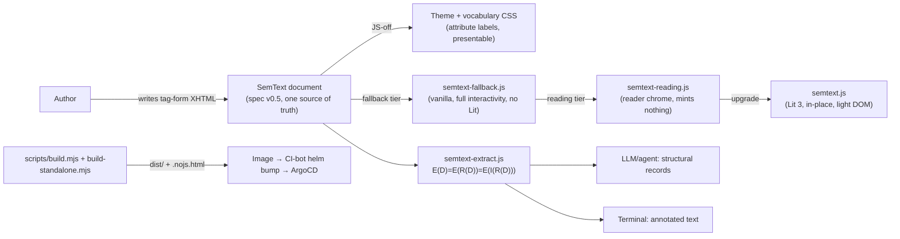

# Project Architecture — SemText

## Overview

SemText (draft spec **v0.5**) is an XHTML-first semantic markup vocabulary
for NPL (Noizu Prompt Lingua): **one document, three readings** — a styled
interactive page in the browser, a structural record for LLM agents, and
plain text via DOM extraction. The document itself is the data; there is no
preprocessing layer. Zero React: Lit 3 web components act as thin
enhancement wrappers over a zero-JS fallback tier that is the architectural
contract.

The repo is **spec-first**: tier-0 specs in `spec/` precede implementation
(`spec/` → `spec/schema/` → `src/` → cypress e2e).

→ *Repo tree: [PROJ-LAYOUT.md](PROJ-LAYOUT.md) · data contract: [PROJ-SCHEMA.md](PROJ-SCHEMA.md)*

## System Diagram

```mermaid
graph LR
    A[Author] -->|writes tag-form XHTML| D["SemText document<br/>(spec v0.5, one source of truth)"]
    D -->|"JS-off"| F["Theme + vocabulary CSS<br/>(attribute labels, presentable)"]
    D -->|"fallback tier"| FB["semtext-fallback.js<br/>(vanilla, full interactivity, no Lit)"]
    FB -->|"reading tier"| RD["semtext-reading.js<br/>(reader chrome, mints nothing)"]
    RD -->|"upgrade"| LIT["semtext.js<br/>(Lit 3, in-place, light DOM)"]
    D --> X["semtext-extract.js<br/>E(D)=E(R(D))=E(I(R(D)))"]
    X --> AG["LLM/agent: structural records"]
    X --> TX["Terminal: annotated text"]
    B["scripts/build.mjs + build-standalone.mjs"] -->|"dist/ + .nojs.html"| H["Image → CI-bot helm bump → ArgoCD"]
```

## Bundle Tiers

Five independent IIFE scripts, built by `scripts/build.mjs`, layering over
the same document: **fallback** (`semtext-fallback.js` — the contract tier,
works with JS off), **reading** (`semtext-reading.js` — prose chrome), **full**
(`semtext.js` — Lit upgrade), **md** (`semtext-md.js`), **extract**
(`semtext-extract.js`). Each carries a minified size budget enforced in CI
via `build:strict` (56 / 14 / 19.5 / 8.5 / 12 KB).

→ *See [arch/bundles.md](arch/bundles.md) for the tier table and budgets*

## Extraction Invariant

`E(D) = E(R(D)) = E(I(R(D)))` — extraction of the authored document equals
extraction of the reading-enhanced and Lit-upgraded versions. Every
interactive layer is chrome and mints nothing. It is an architectural
guarantee: defined over the authored projection, enforced by
`test/e2e/extraction*.cy.js`. Normative contract: `spec/extraction.md` §5
(implements conventions §8).

→ *See [arch/extraction.md](arch/extraction.md) for the guarantee and enforcement*

## Element Vocabulary Model

Tag form canonical (v0.5; class form = Appendix A alias), 16 per-element
schemas under `spec/schema/`. Styling is tier-gated: selectors use the dual
spelling `:is(sem-x, .sem-x)`, and scripts stamp `data-sem-fallback` /
`data-sem-upgraded` markers so hide rules render only on the JS-off tier,
which stays text-only (plain `attr()` labels).

→ *See [arch/vocabulary.md](arch/vocabulary.md) for gating and the degradation ladder*

## Build & Distribution

`scripts/build.mjs` compiles the five bundles; `scripts/build-standalone.mjs`
produces the distributable pages — genuine `.nojs.html` variants and
`sem:inline` markers that inject bundles, themes, measured sizes, and version
labels from `package.json` (`specVersion` v0.5) plus the checkout SHA. Two
portable forms: folder (relative assets) and single-file (all inlined).

→ *See [arch/build-deploy.md](arch/build-deploy.md) for forms and hard rules*

## Deployment

One CI workflow (`test` → `build-push` on `main` → CI-bot `bump-chart` commit
→ ArgoCD auto-sync), plus a CDN publish job gated on the `CDN_PUBLISH` repo
variable. The Docker image serves `dist/{site,demo,spec,themes}` and the
`semtext*.js` bundles from nginx. Nobody hand-edits chart tags.

→ *See [arch/build-deploy.md](arch/build-deploy.md) for the pipeline*

## Key Decisions

Brief; rationale in the linked file.

- **Three tiers, bottom tier is the contract** — zero-JS pages force semantics
  into the document itself. → [arch/decisions.md](arch/decisions.md)
- **Tag form canonical** — bare attributes, no `data-*`; XML-consumer-clean. → [arch/decisions.md](arch/decisions.md)
- **Lit-thin-wrappers-over-fallback** — upgrade in place, light-DOM content,
  chrome mints nothing. → [arch/decisions.md](arch/decisions.md)
- **XHTML over Markdown** — the document is the data; no preprocessing layer. → [arch/decisions.md](arch/decisions.md)
- **Extraction as test-enforced contract** — chrome leakage fails CI, not consumers. → [arch/extraction.md](arch/extraction.md)

## Document Map

- `ROADMAP.md` — waves, strategy, budget history
- `project-management/` — personas and user stories
- `CONTRIBUTING.md` — release policy (develop → main via CI only)
- `spec/` — normative contracts (conventions.md, extraction.md, schema/)
- `docs/PROJ-LAYOUT.md` — components ↔ directories mapping
- `docs/PROJ-SCHEMA.md` — data contract summary

Do not restate their content here.

## Monorepo Role

NPL-ecosystem spec + JS product submodule; couples to the NPL framework
(`Portfolio/Apps/AI/NoizuPromptLingo`) — the vocabulary is the XML variant
of NPL (conventions §9).
