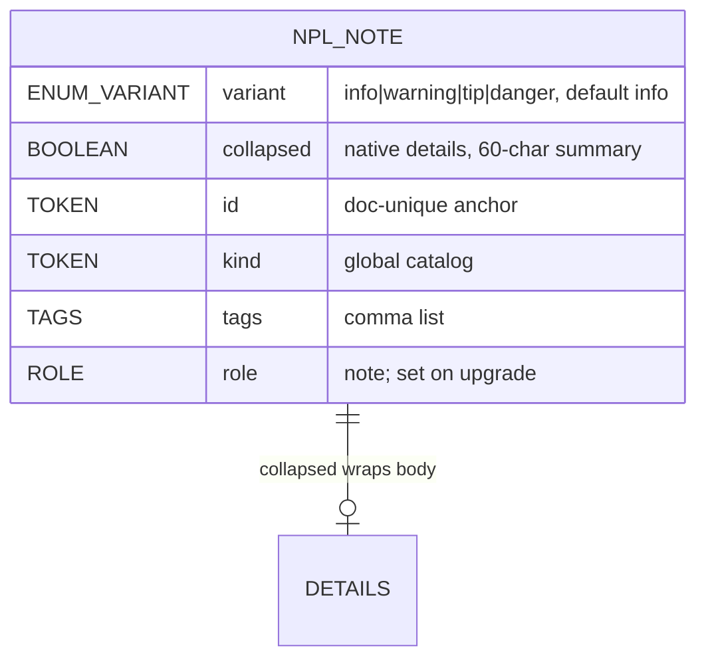

# Data Schema — Summary

Spec-first repo; no relational/KV persistence. Schema = markup contract for
NPL-enhanced XHTML (see [PROJ-SCHEMA.md](PROJ-SCHEMA.md), layout in
[PROJ-LAYOUT.md](PROJ-LAYOUT.md)).

## Core entities

- **Enhanced document** — root `npl-enhanced-document` (v0.4: `div.npl-enhanced-document`); metadata children (`agent`, …) + semantic HTML + `npl-*` vocabulary.
- **Element↔class mapping** — v0.3 custom elements map mechanically to `div/span.npl-*` classes with `data-*` parameters (npl-agent, npl-note, npl-facts, npl-fact, npl-distractor, npl-details/detail, npl-highlight).
- **Global attributes** — `kind`, `tags`, `view-as` (unknown ⇒ list fallback), `status` (`done|current|todo|blocked|pass|fail`), `controls`, `collapsed`, `id`, `data-*`. Attributes canonical; inline notation is sugar.

## npl-note schema

Events: none. Light DOM (searchable). BDD source for `cypress/e2e/npl-note.cy.js`.

## Data files & configs

| Item | Kind |
|------|------|
| `syntax/conventions.md` (v0.4) + `.html` | canonical spec (md source, XHTML render) |
| `demo/index.html` | reference impl: core CSS + Tailwind CDN layer + vanilla fallback JS |
| `package.json` exports | `.` `./preprocess` `./themes/*`; files `dist`, `themes`; dep `lit ^3.3.3` |
| `vite.config.ts` / `tsconfig.json` / `cypress.config.js` | build / types / e2e config |
